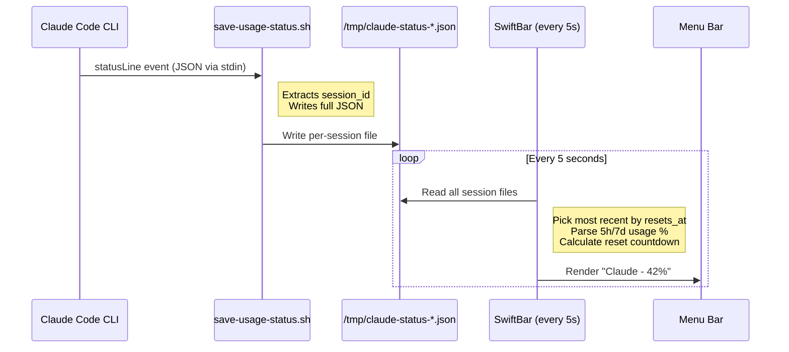
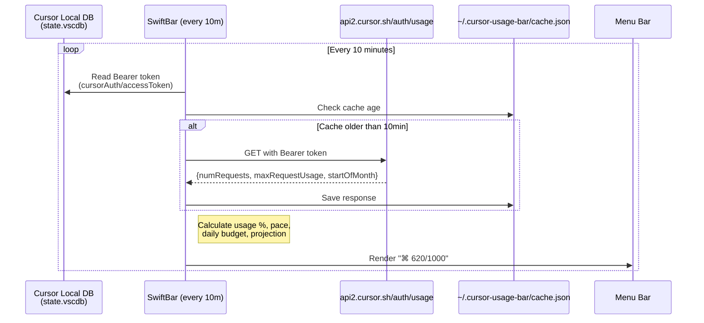

# AI Usage Bar

Real-time **Claude Code** and **Cursor** usage in your macOS menu bar via [SwiftBar](https://swiftbar.app).

[Demo](https://youtu.be/PDRUsuuMiMY)


| Claude Code                               | Cursor                                        |
| ----------------------------------------- | --------------------------------------------- |
| 5h/7d rate-limit windows, resets every 5s | Monthly premium requests, refreshes every 10m |


---

## Install

Pick the integration you want.

### Claude Code

**Prerequisites:** [SwiftBar](https://swiftbar.app) (`brew install --cask swiftbar`), Python 3, [Claude Code CLI](https://claude.ai/download) ≥ 2.1.81

```bash
# One-liner
curl -fsSL https://raw.githubusercontent.com/hohieuu/ai-usage-bar/main/install.sh | bash

# Or clone
git clone https://github.com/hohieuu/ai-usage-bar && bash ai-usage-bar/install.sh
```

### Cursor

**Prerequisites:** [SwiftBar](https://swiftbar.app) (`brew install --cask swiftbar`), Python 3, [Cursor IDE](https://cursor.com) (must be logged in)

```bash
# One-liner
curl -fsSL https://raw.githubusercontent.com/hohieuu/ai-usage-bar/main/cursor-install.sh | bash

# Or clone
git clone https://github.com/hohieuu/ai-usage-bar && bash ai-usage-bar/cursor-install.sh
```


---

## What You See

**Claude Code** — `Claude - 42%` in menu bar

```
Claude Usage
  5h  ████░░░░░░ 42%        ← rate-limit usage
  ⏱   ██████░░░░ 60%        ← time through window
  Resets  2h 18m  ·  14:00
  7d  █░░░░░░░░░ 7%
  Ctx ████░░░░░░ 45%
```

**Cursor** — `⌘ 620/1000` in menu bar

```
claudeCursor Usage
  Month ██████░░░░ 62%       ← premium requests
  620 / 1000 premium requests
Billing Cycle
  ⏱   ████████░░ 77%        ← time through month
  Day 24 of 31 · 7d left
Pace
  Avg 25.8 req/day · Budget 54.3 req/day
  Proj. ~800 at month end · ✓ On track
```

---

## How It Works

Everything runs **locally on your Mac**. No data leaves your machine except Cursor's own API call.

### Claude Code




> **What gets installed:**
>
> - `~/.claude/hooks/save-usage-status.sh` — 7-line hook, reads stdin → writes to `/tmp/`
> - `<SwiftBar plugins>/claude-usage.5s.sh` — display script, reads `/tmp/` files only
> - `~/.claude/settings.json` — adds `statusLine` entry (backed up first)

### Cursor




> **What gets installed:**
>
> - `<SwiftBar plugins>/cursor-usage.10m.sh` — single file, reads Cursor's existing DB
> - `~/.cursor-usage-bar/cache.json` — cached API response (auto-created)
> - **No config files, no tokens to paste, no hooks** — fully zero-config

---

## Uninstall

```bash
# Claude Code
curl -fsSL https://raw.githubusercontent.com/hohieuu/ai-usage-bar/main/uninstall.sh | bash

# Cursor
curl -fsSL https://raw.githubusercontent.com/hohieuu/ai-usage-bar/main/cursor-uninstall.sh | bash
```

