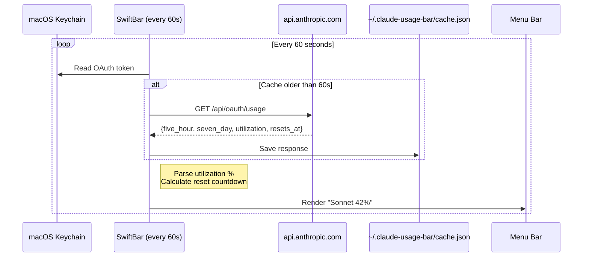
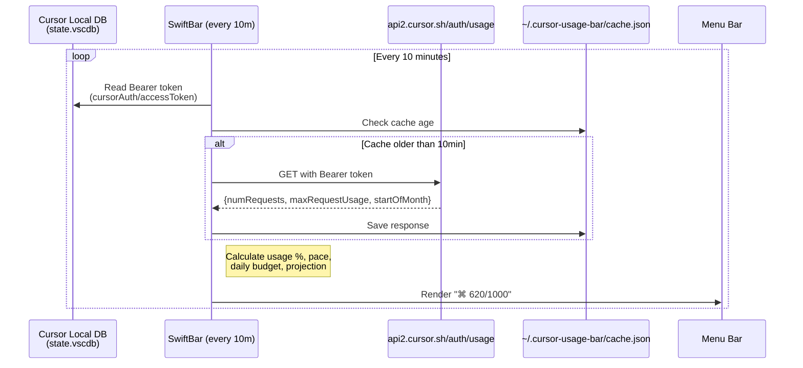

# AI Usage Bar

Real-time **Claude Code** and **Cursor** usage in your macOS menu bar via [SwiftBar](https://swiftbar.app).

[Demo](https://youtu.be/PDRUsuuMiMY)


| Claude Code                                    | Cursor                                        |
| ---------------------------------------------- | --------------------------------------------- |
| 5h/7d rate-limit windows, refreshes every 60s | Monthly premium requests, refreshes every 10m |


---

## Install

<div style="background-color: #D97757; padding: 2px; border-radius: 8px; margin: 16px 0;">
  <div style="background-color: #fff; padding: 16px; border-radius: 6px;">

###  Claude Code

**Prerequisites:** [SwiftBar](https://swiftbar.app) • Python 3 • `jq` • [Claude Code](https://claude.ai/download) (logged in)

```bash
curl -fsSL https://raw.githubusercontent.com/hohieuu/ai-usage-bar/main/install/install.sh | bash
```

or

```bash
git clone https://github.com/hohieuu/ai-usage-bar && bash ai-usage-bar/install/install.sh
```

  </div>
</div>

<div style="background-color: #000000; padding: 2px; border-radius: 8px; margin: 16px 0;">
  <div style="background-color: #fff; padding: 16px; border-radius: 6px;">

###  Cursor

**Prerequisites:** [SwiftBar](https://swiftbar.app) • Python 3 • [Cursor IDE](https://cursor.com) (logged in)

```bash
curl -fsSL https://raw.githubusercontent.com/hohieuu/ai-usage-bar/main/install/cursor-install.sh | bash
```

or

```bash
git clone https://github.com/hohieuu/ai-usage-bar && bash ai-usage-bar/install/cursor-install.sh
```

  </div>
</div>


---

## What You See

**Claude Code** — `Sonnet 42%` in menu bar

```
Claude Usage
  5h  ████░░░░░░ 42%        ← rate-limit usage
  ⏱   ██████░░░░ 60%        ← time through window
  Resets  2h 18m  ·  14:00
  7d  █░░░░░░░░░ 7%
  ⏱   ███░░░░░░░ 26%
  Resets  5d 4h  ·  Mon 14:00
  Updated 14:02:35
```

> Displays current usage across 5-hour and 7-day rate-limit windows.

**Cursor** — `⌘ 620/1000` in menu bar

```
Cursor Usage
  Month ██████░░░░ 62%       ← premium requests
  620 / 1000 premium requests
Billing Cycle
  ⏱   ████████░░ 77%        ← time through month
  Day 24 of 31 · 7d left
Pace
  Avg 25.8 req/day · Budget 54.3 req/day
  Proj. ~800 at month end · ✓ On track
```

---

## How It Works

Everything runs **locally on your Mac**. No data leaves your machine except Cursor's own API call.

### Claude Code



> **What gets installed:**
>
> - `<SwiftBar plugins>/claude-usage.60s.sh` — display plugin, calls Anthropic API directly
> - `~/.claude-usage-bar/cache.json` — cached API response (auto-created)

### Cursor




> **What gets installed:**
>
> - `<SwiftBar plugins>/cursor-usage.10m.sh` — single file, reads Cursor's existing DB
> - `~/.cursor-usage-bar/cache.json` — cached API response (auto-created)
> - **No config files, no tokens to paste, no hooks** — fully zero-config

---

## Uninstall

<div style="background-color: #D97757; padding: 2px; border-radius: 8px; margin: 16px 0;">
  <div style="background-color: #fff; padding: 16px; border-radius: 6px;">

###  Claude Code

```bash
curl -fsSL https://raw.githubusercontent.com/hohieuu/ai-usage-bar/main/install/uninstall.sh | bash
```

  </div>
</div>

<div style="background-color: #000000; padding: 2px; border-radius: 8px; margin: 16px 0;">
  <div style="background-color: #fff; padding: 16px; border-radius: 6px;">

###  Cursor

```bash
curl -fsSL https://raw.githubusercontent.com/hohieuu/ai-usage-bar/main/install/cursor-uninstall.sh | bash
```

  </div>
</div>
